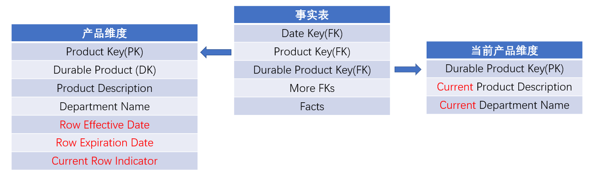

# 缓慢变化维

[TOC]

## 1 简介

Slowly Changing Dimensions，被简写为 SCD。

维度的属性会随着时间的流失发生缓慢的变化，这种维度称为缓慢变化维。

例如，一个员工维表，包含了员工的id、名字、任职地区。那么随着时间的变化，员工可能会从子公司A调到子公司B，那么任职地区就发生了变化。

## 2 如何处理缓慢变化维

### 2.1 类型0: 原样保留

维度属性值不做更改，保留原始值。

此方式什么也不做，所以称之为方式0。

比如客户维度的客户原始信用分值，和日期维度的大多数属性。

客户主键|客户自然键|客户名字|所在地址|所在州|所在地邮编|客户原始信用分值
-------------|:------------|:--------------|:---------|:--------|:---------|:---------
Customer Key | Customer Id | Customer Name | Customer Address| Customer State| Customer Zip|  Orig Authorization Credit Score

### 2.2 类型1: 重写

维度行中原来的属性值会被新值覆盖，所以这个属性不会保存它的所有历史记录，总是反映最新的情况。


```sql
create table product_dim(
    product_key int,
    sku_number string,
    product_description string,
    product_type string
)
comment "产品维度表"
row format delimited fields terminated by ','
stored as textfile;

-- 【xiaomi PC 按照 Strategy 类产品销售】
-- product1.txt
-- 1,ABC922-Z,xiaomiPC,Strategy
-- 2,ABC923-Z,HPprinter,Strategy
-- 3,DEF924-Z,lenovoprinter,Education
-- 4,DEF925-Z,dellPC,Education

-- 正常情况下，应该是从业务数据库同步而来，这里直接从文本文件导入
load data local inpath '/mnt/sda4/data/product1.txt' into table product_dim;

hive> select * from product_dim;
1       ABC922-Z        xiaomiPC        Strategy
2       ABC923-Z        HPprinter       Strategy
3       DEF924-Z        lenovoprinter   Education
4       DEF925-Z        dellPC  Education

-- 当 xiaomiPC 由 Strategy 修改成 Education；新增lenovoPC
-- product2.txt
-- 1,ABC922-Z,xiaomiPC,Education
-- 2,ABC923-Z,HPprinter,Strategy
-- 3,DEF924-Z,lenovoprinter,Education
-- 4,DEF925-Z,dellPC,Education
-- 5,DEF926-Z,lenovoPC,Education

-- 采用类型1重写方法，那么就直接使用 overwrite 覆盖更新 product_dim
load data local inpath '/mnt/sda4/data/product2.txt' overwrite into table product_dim;

hive> select * from product_dim;
1       ABC922-Z        xiaomiPC        Education
2       ABC923-Z        HPprinter       Strategy
3       DEF924-Z        lenovoprinter   Education
4       DEF925-Z        dellPC  Education
5       DEF926-Z        lenovoPC        Education
```

所以当它变化的时候，需要注意：

- 同样的BI应用在属性值 `product_type` 按类型1方式变化前后，可能会产生不同的结果
- 所有按照原先的属性值 `Strategy` 产生的汇总结果都需要重新执行（看具体业务而论）
- 若维度模型通过 OLAP 多维数据库部署，那么多维数据库的 cube 也可能需要重新计算

```sql
-- 重新执行汇总结果时：
-- 可以将新数据和旧的受影响的数据分别更新
-- 也可以使用动态分区，批量更新，比如
hive> set hive.exec.dynamic.partition=true;
hive> set hive.exec.dynamic.partition.mode=nonstrict;

insert overwrite table sales partition(dt)
select product_type,quantity,amount,dt
from(
select a.dt, b.product_type, 
    sum(a.procurement_transaction_quantity) quantity,
    sum(a.procurement_transaction_dollar_amount) amount
from procurement_transaction_fact a
    join product_dim b on a.product_key=b.product_key
group by a.dt,b.product_type
) t;
```

### 2.3 类型2: 增加新行

#### 2.3.1 增加新行

在维度表中增加新行，新行中使用修改的属性值，而旧行的属性值不变。

此时，维度表不能仅使用自然键或持久键，否则就会出现多行描述同一成员，也就是有多行的自然键相同。

所以要有一列主代理键作为事实表的外键，用来唯一标识一行，当新增一行时，为该行分配一个新的主代理键。

这种方法需要在维度表中，新增三列：`行有效日期/时间戳`、`行截止日期/时间戳` 和 `当前行标识`。

这种方法既保留了历史信息，又能反映最新的信息，而且不会存在类型1中存在的问题（修改前后产生不同的结果；重新计算cube）

```sql
create table product_dim(
    product_key int,   -- 作为主代理键
    sku_number string,  -- 自然键
    product_description string,
    product_type string,
    begin_date string, -- 有效日期
    end_date string,  -- 截止日期
    isCurrent string -- 当前行标识
)
comment "产品维度表"
row format delimited fields terminated by ','
stored as textfile;

-- 【xiaomi PC 按照 Strategy 类产品销售】
-- product1.txt
-- 1,ABC922-Z,xiaomiPC,Strategy,20120101,99991231,y
-- 2,ABC923-Z,HPprinter,Strategy,20120101,99991231,y
-- 3,DEF924-Z,lenovoprinter,Education,20120101,99991231,y
-- 4,DEF925-Z,dellPC,Education,20120101,99991231,y

load data local inpath '/mnt/sda4/data/product1.txt' overwrite into table product_dim;

-- 假设，当前产品维度表有一天的数据了
hive> select * from product_dim;
1       ABC922-Z        xiaomiPC        Strategy        20120101        99991231        y
2       ABC923-Z        HPprinter       Strategy        20120101        99991231        y
3       DEF924-Z        lenovoprinter   Education       20120101        99991231        y
4       DEF925-Z        dellPC  Education       20120101        99991231        y

create table product_dim_update(
    product_key int,
    sku_number string,
    product_description string,
    product_type string
)
comment "产品维度增量表"
partitioned by (dt string)
row format delimited fields terminated by ','
stored as textfile;

-- 【xiaomi PC 按照 Strategy 类产品销售】
-- product2.txt
-- 1,ABC922-Z,xiaomiPC,Strategy
-- 2,ABC923-Z,HPprinter,Strategy
-- 3,DEF924-Z,lenovoprinter,Education
-- 4,DEF925-Z,dellPC,Education

load data local inpath '/mnt/sda4/data/product2.txt' overwrite into table product_dim_update partition(dt="20220101");

-- 假设，已经使用product_dim_update表更新了一次product_dim表
hive> select * from product_dim_update;
1       ABC922-Z        xiaomiPC        Strategy        20220101
2       ABC923-Z        HPprinter       Strategy        20220101
3       DEF924-Z        lenovoprinter   Education       20220101
4       DEF925-Z        dellPC  Education       20220101

-- 现在数据发生变化: xiaomiPC由Strategy修改成Education；新增lenovoPC
-- 主键是5和6，（要根据具体业务，决定如何为新行赋予一个新的主键）
-- hive自增序列问题参考: https://github.com/ZGG2016/hive/blob/master/%E6%96%87%E6%A1%A3/hive%E8%87%AA%E5%A2%9E%E5%BA%8F%E5%88%97%E9%97%AE%E9%A2%98.md
-- product3.txt
-- 5,ABC922-Z,xiaomiPC,Education  
-- 6,DEF926-Z,lenovoPC,Education

load data local inpath '/mnt/sda4/data/product3.txt' overwrite into table product_dim_update partition(dt="20220102");

hive> select * from product_dim_update;
1       ABC922-Z        xiaomiPC        Strategy        20220101
2       ABC923-Z        HPprinter       Strategy        20220101
3       DEF924-Z        lenovoprinter   Education       20220101
4       DEF925-Z        dellPC  Education       20220101
5       ABC922-Z        xiaomiPC        Education       20220102
6       DEF926-Z        lenovoPC        Education       20220102

-- 也可以把sql中的时间常量，替换成变量表示，比如：
--  SET hivevar:pre_date = DATE_ADD(CURRENT_DATE(),-1);  
--  SET hivevar:max_date = CAST('99991231' AS DATE);
-- 具体参考：https://www.cnblogs.com/RzCong/p/10695353.html
-- 采用类型2: 新增一行方式，更新product_dim
insert overwrite table product_dim
select * from
(
select a.product_key, 
       a.sku_number,
       a.product_description, 
       a.product_type,
       a.begin_date,
       case 
           when a.end_date="99991231" and b.sku_number is not null then "20220101"
           else a.end_date 
        end as end_date,
        case 
           when a.end_date="99991231" and b.sku_number is not null then "n"
           else a.isCurrent  
        end as isCurrent
from product_dim a 
    left join (select * from product_dim_update where dt="20220102") b 
    on a.sku_number=b.sku_number
union
select product_key, 
       sku_number,
       product_description, 
       product_type,
       "20220102" as begin_date,
       "99991231" as end_date,
       "y" as isCurrent
from product_dim_update 
where dt="20220102"
) t;

-- 查看结果 （第一行和第五行）
hive> select * from product_dim;
1       ABC922-Z        xiaomiPC        Strategy        20120101        20220101        n
2       ABC923-Z        HPprinter       Strategy        20120101        99991231        y
3       DEF924-Z        lenovoprinter   Education       20120101        99991231        y
4       DEF925-Z        dellPC  Education       20120101        99991231        y
5       ABC922-Z        xiaomiPC        Education       20220102        99991231        y
6       DEF926-Z        lenovoPC        Education       20220102        99991231        y
```

要确定一定日期范围的维度行：

- 如果行的截止日期正好等于下一行的有效日期，那么 `>=begin_date and <end_date`
- 如果行的截止日期比下一行的有效日期晚一天（如上例），那么 `>=begin_date and <=end_date` 或使用 `between and`

#### 2.3.2 类型1和类型2混合

当另一个属性发生类型2变化后，该属性也应该正确运行类型1变化。

产品键 | 产品统一编号 | 产品描述 |  部门名称 | 推出日期 | 有效日期 | 失效日期 | 当前行指示器
------|:------------|:---------|:---------|:--------|:---------|:---------|:----------
12345 |   ABC922-Z  | Intelli  | Education| 20121215| 20120101|  99991231| Currrent

按照类型2变化的部门名称和类型1变化的推出日期

产品键 | 产品统一编号 | 产品描述 |  部门名称 | 推出日期 | 有效日期 | 失效日期 | 当前行指示器
------|:------------|:---------|:---------|:--------|:---------|:---------|:----------
12345 |   ABC922-Z  | Intelli  | Education| 20120101| 20120101|  20130131 | Expired
25984 |   ABC922-Z  | Intelli  | Strategy | 20120101| 20130201|  99991231 | Currrent

针对此场景，应该由业务数据管理员制定最终的ETL业务规则（也就是如何更新此表）

### 2.4 类型3: 增加新列

虽然类型2既能保留历史数据，又能反映最新的数据，但是无法将历史数据和最新数据关联起来。

上例中，当按照 Education 过滤时，只能看到 product_key 等于 5 的那条新数据，不能同时看到 product_key 等于 1 的那条旧数据。（或者说不能基于历史属性值汇总，再或者说不能比较基于历史属性值的汇总和基于最新值的汇总）

而类型3就可以展现这种关系，不是增加一行，而是增加一列，这样产生了旧属性列和新属性列。

产品列表和销售队伍重组场景，是类型3的主要使用场景。比如，一个产品先前属于一个 product_type，之后属性另一个 product_type。

产品键 | 产品统一编号 | 产品描述 |  部门名称 | 
------|:------------|:---------|:---------|
12345 |   ABC922-Z  | Intelli  | Education|

发生类型3变化后

产品键 | 产品统一编号 | 产品描述 |  部门名称 | 先前部门名称 |
------|:------------|:---------|:---------|:------------|
12345 |   ABC922-Z  | Intelli  | Strategy | Education   |

“部门名称”就是旧属性列，“先前部门名称”就是新属性列。

旧属性列使用类型1重写的方法改变，新属性列就是使用原来的值。

如果一个产品所属的 product_type 每年都变化（周期变化和可预测），那么此时就相应的增加列。此时，就能基于任意历史属性汇总数据。

产品键 | 产品统一编号 | 产品描述 |  部门名称 | 2022部门名称 | 2021部门名称     |
------|:------------|:---------|:---------|:------------|:-----------------|
12345 |   ABC922-Z  | Intelli  | Strategy | Education   |  Not Application |

- “部门名称”也可以叫做“当前部门名称”
- “2022部门名称”就是2022年所属的部门名称
- “2021部门名称”就是2021年所属的部门名称。这里的 "Not Application" 表示产品在这年还没推出

类型3变化类型存在两个问题：

- 不适用于不可预测的属性变化（因为要提前确定表头）
- 如果使用OLAP多维数据库建模，那么cube需要重新计算，如同类型1变化。

```sql
create table product_dim(
    product_key int,
    sku_number string,
    product_description string,
    new_product_type string,
    old_product_type string
)
comment "产品维度表"
row format delimited fields terminated by ','
stored as textfile;

-- xiaomi PC 按照 Strategy 类产品销售
-- product.txt
-- 1,ABC922-Z,xiaomiPC,Strategy,NotApplication
-- 2,ABC923-Z,HPprinter,Strategy,NotApplication
-- 3,DEF924-Z,lenovoprinter,Education,NotApplication
-- 4,DEF925-Z,dellPC,Education,NotApplication

hive> load data local inpath '/mnt/sda4/data/product.txt' overwrite into table product_dim;
hive> select * from product_dim;
1       ABC922-Z        xiaomiPC        Strategy        NotApplication
2       ABC923-Z        HPprinter       Strategy        NotApplication
3       DEF924-Z        lenovoprinter   Education       NotApplication
4       DEF925-Z        dellPC  Education       NotApplication

create table product_dim_update(
    product_key int,
    sku_number string,
    product_description string,
    product_type string
)
comment "产品维度增量表"
partitioned by (dt string)
row format delimited fields terminated by ','
stored as textfile;

-- 现在 xiaomi PC 按照 Education 类产品销售
-- product2.txt
-- 1,ABC922-Z,xiaomiPC,Education

hive> load data local inpath '/mnt/sda4/data/product2.txt' overwrite into table product_dim_update partition(dt="20220102");
hive> select * from product_dim_update;
1       ABC922-Z        xiaomiPC        Education       20220102

-- 采用类型3: 新增一列方式，更新product_dim
insert overwrite table product_dim
select a.product_key, 
       a.sku_number,
       a.product_description, 
       if(b.sku_number is not null, b.product_type, a.new_product_type) as new_product_type,
       if(b.sku_number is not null, a.new_product_type, a.old_product_type) as old_product_type
from product_dim a 
    left join (select * from product_dim_update where dt="20220102") b 
    on a.sku_number=b.sku_number;

-- 查看结果
hive> select * from product_dim;
1       ABC922-Z        xiaomiPC        Education       Strategy
2       ABC923-Z        HPprinter       Strategy        NotApplication
3       DEF924-Z        lenovoprinter   Education       NotApplication
4       DEF925-Z        dellPC  Education       NotApplication
```

### 2.5 类型4: 增加微型维度

如果维度表中有数百万行记录或者还要多，而且这些记录中的某些字段又经常变化，这些字段一般称之为快变超大维度。

微型维度的提出主要是为了解决快变超大维度(rapidly changing monster dimension)。

解决的方法是，将分析频率比较高或者变化频率比较大的字段提取出来，建立一个单独的维度表，这个单独的维度表就是微型维度表，
或者当一张维度表达几百万行时，也可以设计成微型维度表。

微型维度表有自己的主键，这个键和原维度表的键一起放入事实表。

有时为了分析的方便，可以把微型维度的键的最新值作为外键进入基维度表。这时一定要注意，这个外键必须做类型1处理。

比如，将客户维度中的人口统计信息（年龄范围、收入范围等）放入一个微型维度中，该微型维度的主键也放入事实表中。


由上图可知，

- 微型维度（人口统计维度）也有自己的主键
- 基维度表（客户维度）和微型维度（人口统计维度）的主键都以外键的形式存在事实表中

如果有像收入这样分布范围较广、不断变化的离散属性时，应该将它分段处理。比如，存储 `$31257.98` 这样过于分散的数值就不如存储 `$30000－$34999` 这样的范围。这样可以极大的减少微型维度中的记录数目，也给分析带来方便。

> 人口统计维度表

|人口统计键 |年龄范围 |购买频繁程度|收入范围      |
|:---------|:-------|:----------|:-------------|
|1         |21-25   |Low        |<$30000       |
|2         |21-25   |Medium     |<$30000       |
|3         |21-25   |High       |<$30000       |
|4         |21-25   |Low        |$30000-$39999 |
|5         |21-25   |Medium     |$30000-$39999 |
|6         |21-25   |High       |$30000-$39999 |
|...       |...     |...        |...           |
|142       |26-30   |Low        |<$30000       |
|143       |26-30   |Medium     |<$30000       |
|144       |26-30   |High       |<$30000       |
|...       |...     |...        |...           |


上表中，

- 将年龄和收入离散属性以范围的形式存储
- 假定购买频繁程度和收入范围字段不变，某一人A随着年龄的变化，会定位到该表的不同行，此时，由此计算的事实表的新数据不会影响旧数据，所以也反映数据的变化情况，所以 OLAP 中的 cube 不需要重新计算。（见下面的示例）
- 也存在一个问题，即该维度表不能增长过大。如上表，包含3个字段，每个字段按3个可能的值计算，那么就有3^3=27行。当某一微型维度表有5个属性，每个字段按10个可能的值计算，那么就有10^5=100000行。

```sql
create table customer_dim(
    customer_key int,
    customer_id int, 
    customer_name string,
    customer_province string,
    customer_birthday string
)
comment "客户维度表"
row format delimited fields terminated by ','
stored as textfile;

-- customer.txt
-- 1,1,zhangsan,sichuang,19980120
-- 2,2,lisi,beijing,19960202

hive> load data local inpath '/mnt/sda4/data/customer.txt' overwrite into table customer_dim;
hive> select * from customer_dim;
1       1       zhangsan        sichuang        19980120
2       2       lisi    beijing 19960202

-- 单独、提前定义微型维度表，客户维度表可以保持不变
create table demographgics_dim(
    demographgics_key int,
    age_band string, 
    purchase_frequency string,
    income_band string
)
comment "人口统计维度表"
row format delimited fields terminated by ','
stored as textfile;

-- demographgics.txt
-- 1,21-25,Low,<$30000
-- 2,21-25,High,<$30000
-- 3,21-25,Low,$30000-$39999
-- 4,21-25,High,$30000-$39999
-- 5,26-30,Low,<$30000
-- 6,26-30,High,<$30000
-- 7,26-30,Low,$30000-$39999
-- 8,26-30,High,$30000-$39999

hive> load data local inpath '/mnt/sda4/data/demographgics.txt' overwrite into table demographgics_dim;
hive> select * from demographgics_dim;
1       21-25   Low     <$30000
2       21-25   High    <$30000
3       21-25   Low     $30000-$39999
4       21-25   High    $30000-$39999
5       26-30   Low     <$30000
6       26-30   High    <$30000
7       26-30   Low     $30000-$39999
8       26-30   High    $30000-$39999

create table sales(
    date_key int,
    customer_key int,
    demographgics_key int,
    product_num int,  -- 客户购买产品的总数量
    total_amount decimal(10,2)  -- 客户花费的总金额
)
comment "销售表"
partitioned by (dt string)
row format delimited fields terminated by ','
stored as textfile;

-- sales.txt
-- 用户1(zhangsan)在1月份年龄是25，到了2月份年龄是26，其他人口统计信息不变
-- 20230101,1,1,100,5000.00
-- 20230101,2,1,50,300.00
-- 20230102,1,1,20,600.00
-- 20230102,2,1,10,200.00

-- 20230201,1,5,150,3000.00
-- 20230201,2,8,20,300.00
-- 20230202,1,5,60,1600.00
-- 20230202,2,8,80,1200.00

hive> load data local inpath '/mnt/sda4/data/sales.txt' overwrite into table sales partition(dt="202301");
hive> load data local inpath '/mnt/sda4/data/sales.txt' overwrite into table sales partition(dt="202302");
hive> select * from sales;
20230101        1       1       100     5000.00 202301
20230101        2       1       50      300.00  202301
20230102        1       1       20      600.00  202301
20230102        2       1       10      200.00  202301
20230201        1       5       150     3000.00 202302
20230201        2       8       20      300.00  202302
20230202        1       5       60      1600.00 202302
20230202        2       8       80      1200.00 202302

-- 用户1(zhangsan)在2023年1月和2月的购买情况 （能够反映数据的变化情况）
select a.dt,
    sum(product_num) product_num,
    sum(total_amount) total_amount
from sales a 
    join (select * from customer_dim where customer_name='zhangsan') b on a.customer_key=b.customer_key
    join demographgics_dim c on a.demographgics_key=c.demographgics_key
where a.dt between '202301' and '202302'
group by a.dt
order by dt;

202301  120     5600.00
202302  210     4600.00
```

### 2.6 类型5: 增加微型维度与类型1支架

#### 2.6.1 支架维度

维度表中包含对其他维度表的引用，被引用的维度称为支架维度。

比如，客户维度中的首次购买日期，如果要按照日历属性（如按月度、年度、财务月度等）进行汇总，那么这么日期必须转变成引用日期维度的外键（也就是将首次购买日期建成客户维度的支架维度）。


应该尽量少用，因为多数情况下，维度之间的关联应该在事实表通过两个维度的外键来实现。

```sql
create table customer_dim(
    customer_key int,
    customer_id int, 
    date_of_first_purchase_key int,
    customer_name string,
    customer_province string
)
comment "客户维度表"
row format delimited fields terminated by ','
stored as textfile;

-- customer.txt
-- 1,1,1,zhangsan,sichuang
-- 2,2,2,lisi,beijing

hive> load data local inpath '/mnt/sda4/data/customer.txt' overwrite into table customer_dim;
hive> select * from customer_dim;
1       1       1       zhangsan        sichuang
2       2       2       lisi    beijing

-- 单独、提前定义微型支架维度表，定义出每一天的属性。客户维度表添加一列外键（根据日期匹配这个支架表，更新增列的数据）。
create table date_of_first_purchase_dim(
    date_of_first_purchase_key int,
    date_of_first_purchase string, 
    date_of_first_purchase_month string,
    date_of_first_purchase_year string,
    date_of_first_purchase_season string
)
comment "首次购买日期维度"
row format delimited fields terminated by ','
stored as textfile;

-- firstdate.txt 省略了中间日期
-- 1,20220101,202201,2022,spring
-- 2,20221201,202212,2022,winter

hive> load data local inpath '/mnt/sda4/data/firstdate.txt' overwrite into table date_of_first_purchase_dim;
hive> select * from date_of_first_purchase_dim;
1       20220101        202201  2022    spring
2       20221201        202212  2022    winter

create table sales(
    transaction_date_key int,
    customer_key int,
    product_num int,  -- 客户购买产品的总数量
    total_amount decimal(10,2)  -- 客户花费的总金额
)
comment "销售表"
partitioned by (dt string)
row format delimited fields terminated by ','
stored as textfile;

-- sales.txt
-- 20230101,1,100,5000.00
-- 20230101,2,50,300.00
-- 20230102,1,20,600.00
-- 20230102,2,10,200.00

-- 20230201,1,150,3000.00
-- 20230201,2,20,300.00
-- 20230202,1,60,1600.00
-- 20230202,2,80,1200.00

hive> load data local inpath '/mnt/sda4/data/sales.txt' overwrite into table sales partition(dt="202301");
hive> load data local inpath '/mnt/sda4/data/sales.txt' overwrite into table sales partition(dt="202302");
hive> select * from sales;
20230101        1       100     5000.00 202301
20230101        2       50      300.00  202301
20230102        1       20      600.00  202301
20230102        2       10      200.00  202301
20230201        1       150     3000.00 202302
20230201        2       20      300.00  202302
20230202        1       60      1600.00 202302
20230202        2       80      1200.00 202302

-- 首次购买日期在2022年1月份的用户的购买情况
select d.date_of_first_purchase_month,
    sum(product_num) product_num,
    sum(total_amount) total_amount
from sales c 
  join (select a.customer_key,b.date_of_first_purchase_month from customer_dim a 
           join date_of_first_purchase_dim b on a.date_of_first_purchase_key=b.date_of_first_purchase_key
           where b.date_of_first_purchase_month="202201") d on c.customer_key=d.customer_key
group by d.date_of_first_purchase_month;

202201  330     10200.00
```

#### 2.6.2 微型维度与类型1支架

在建立类型4微型维度的基础之上，并在基维度中增加**当前**微型维度主键，作为基维度的一个属性。

所以在类型5这种情况下，微型维度的主键不仅存在于事实表中，也存在于基维度中，这样能访问到历史属性和当前属性。

这样也能确保当前分配的微型维度属性能够和基维度上的其他维度一起访问，而不用再通过事实表连接。


在展现区，需要将基维度和微型维度支架表示成一个表。


注意：

- 每当当前微型维度分配发生变化时，使用类型1方法重写微型维度引用，不保留历史。（见下面的示例）
- 基于角色维度的当前属性应该具有不同的列名，如在支架维度中是 current age band，而在人口统计维度中是 age band
- 仍需要为用户提供两种访问统计数据的方法，要么通过微型维度表，要么通过支架表

```sql
create table customer_dim(
    customer_key int,
    customer_id int, 
    customer_name string,
    current_age_band string,
    current_income_band string
)
comment "客户维度表"
row format delimited fields terminated by ','
stored as textfile;

create table customers(
    customer_id int, 
    customer_name string,
    customer_birthday string,
    customer_income decimal(10,2)
)
comment "客户表"
row format delimited fields terminated by ','
stored as textfile;

-- customer.txt
-- 1,zhangsan,19980120,20000.00
-- 2,lisi,19960202,35000.00

hive> load data local inpath '/mnt/sda4/data/customer.txt' overwrite into table customers;
hive> select * from customers;
1       zhangsan        19980120        20000.00
2       lisi    19960202        35000.00

-- 当zhangsan的年龄范围由21-25变成了26-30
-- 2024改成自动日期 select year(current_timestamp());
insert overwrite table customer_dim
select 
    row_number() over(order by 1) as customer_key,
    customer_id, customer_name,
    case 
        when 2024-cast(substr(customer_birthday,1,4) as int) between 21 and 25 then '21-25'
        when 2024-cast(subStr(customer_birthday,1,4) as int) between 26 and 30 then '26-30'
        else 'other'
    end as current_age_band,
    case 
        when customer_income between 0 and 30000 then '<$30000'
        when customer_income between 30001 and 39999 then '$30000-$39999'
        else 'other'
    end as current_income_band
from customers;

hive> select * from customer_dim;
OK
1       2       lisi    26-30   $30000-$39999
2       1       zhangsan        26-30   <$30000
```

### 2.7 类型6: 将类型1属性增加到类型2维度
 
产品维度原始行

产品键 | 产品统一编号 | 产品描述 |  历史部门名称 | 当前部门名称 | 行有效日期 | 行失效日期 | 当前行标识 |
------|:------------|:---------|:-------------|:------------|:----------|:----------|:----------|
12345 |   ABC922-Z  | Intelli  |  Education   | Education   |  20120101 | 99991231  | Current   |

按照第一个部门重新分配的产品维度行

产品键| 产品统一编号 | 产品描述  | 历史部门名称  | 当前部门名称| 行有效日期 | 行失效日期 | 当前行标识 |
------|:------------|:---------|:-------------|:-----------|:----------|:----------|:----------|
12345 |   ABC922-Z  | Intelli  |  Education   | Strategy   |  20120101 | 20130131  | Expired   |
25984 |   ABC922-Z  | Intelli  |  Strategy    | Strategy   |  20130201 | 99991231  | Current   |

上表中，

- “当前部门名称”字段使用类型1重写的方式处理
- “历史部门名称”和“当前部门名称”是类型3新增列的处理方式
- “行有效（失效）日期”是类型2新增行的处理方法

处理流程上，当部门变化时，（先不考虑“当前部门名称”）“历史部门名称”字段使用了类型2方式处理，即新增一行。
再考虑“当前部门名称”字段，使用类型1方式重写该字段。

所以说，类型6是类型1、类型2和类型3的结合，即为获取变化建立新行（历史），增加新列以跟踪当前分配（最新），新列的后续变化采用重写处理。

此类型复杂，在使用中要考虑市际的业务用户场景，在灵活性和复杂性间权衡。

### 2.8 类型7: 双重类型1与类型2维度

将维度表（当前产品维度视图）建模成类型1维度，用来展示最新属性值，通过持久键(Durable Product Key)和事实表连接。

将维度表（产品维度）建模成类型2维度，展示最新历史概要，通过主代理键(Product Key)和事实表连接。

所以，维度的持久键和主代理键同时存在事实表上，事实表可以通过主代理键连接维表获取历史维度属性，通过持久键连接维表获取当前维度属性。



当需要基于任意时间点概要上卷历史事实时，类型7非常有效。例如，基于去年12月1日开始有效的层次构建三年历史度量报表，可以这么考虑：

- 先在产品维度表中，使用有效日期和失效日期过滤出来去年12月1日开始有效的行(begin_date>=20111201 and end_date<=99991231)
- 再使用过滤出来的数据，通过持久键和事实表连接上卷事实。

这种类型7双重键的变体就是使用单一代理键，如下图


但是在变体的这种情况下，要根据产品维度中同一个 Durable Product Key 的行建立当前维度视图，如下表

> 产品维度表

产品键| 产品统一编号 | 持久性产品键 | 产品描述  | 部门名称  | 行有效日期 | 行失效日期 | 当前行标识 |
------|:-----------|:------------|:---------|:----------|:----------|:----------|:----------|
12345 | ABC922-Z   |  12345      |  Intelli | Education | 20120101  | 20130131  | Expired   |
25984 | ABC922-Z   |  12345      |  Intelli | Strategy  | 20130201  | 20130630  | Expired   |
31726 | ABC922-Z   |  12345      |  Intelli | Critical..| 20130701  | 99991231  | Current   |

> 当前产品维度视图

产品键| 产品统一编号 | 持久性产品键 | 【当前】产品描述  | 【当前】部门名称  | 
------|:-----------|:------------|:-------------|:-------------|
12345 | ABC922-Z   |  12345      |  Intelli     | Critical..   | 
25984 | ABC922-Z   |  12345      |  Intelli     | Critical..   |   
31726 | ABC922-Z   |  12345      |  Intelli     | Critical..   |

相比类型6，

- 类型7具有更少的ETL工作，因为当前产品维度视图可以根据产品维度表创建而来，而类型6则要更复杂。
- 对于基于当前属性值的查询，类型7要比类型6更方便，因为类型7可以直接根据当前产品维度视图查询，而类型6需要先匹配到产品，再过滤出当前行。

------------------------------------------

**更多内容查看工具书 2.5 节和 5.3 节**
