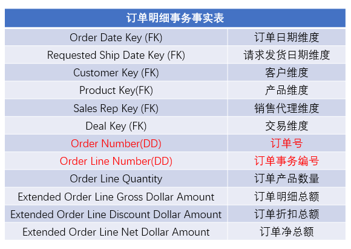

## 退化维度

当维度除了主键外没有其他内容，且量级很大，例如发票号、订单号、保单号或合同号，没必要用一张维度表来进行存储，而我们进行数据查询或者数据过滤的时候又非常需要，那么就把这种维度退化到事实表中，作为一列，表明没有关联的维度表。



特点：

- 具有普通维的各种操作，比如：上卷，切片，切块等。（比如发票号码包含了一些信息，比如事务日期、商店标识）
- 用作分组键，比如按照订单号，将订单中的明细项分到一组
- 如果存在退化维度，那么在ETL的过程将会变得容易。比如在业务系统数据库中，订单号存在订单表中，ETL过程中不必单建维度表
- 做主键的一部分

如果这个维度还有附加的属性，且不属于其他维度，那么就不能将其退化。比如，如果基于保险项目和保险项为每个保单建立的一个整体的风险级别，那么这个风险级别字段就属于保单维度，就不能退化保单号。

【6.2.6节 16.2.6节】

创建一个新表，在新表里添加 order_number 字段，再整体插入

在维度退化之后，还需要修改数据装载脚本事实表中的退化维度，而不再需要导入维度表中

```sql
create table order_dim(
    order_key int,
    order_number string
)
comment "订单维度表"
row format delimited fields terminated by ','
stored as textfile;

-- orderdim.txt
-- 1,1111111111
-- 2,2222222222
-- 3,3333333333

hive> load data local inpath '/mnt/sda4/data/orderdim.txt' into table order_dim;
hive> select * from order_dim;
1       1111111111
2       2222222222
3       3333333333

create table order_detail_fact(
    order_date_key int,
    customer_key int,
    product_key int,
    order_key int,
    order_quantity int,
    order_amount double
)
comment "订单明细事务事实表"
partitioned by (dt string)
row format delimited fields terminated by ','
stored as textfile;

-- orderfact.txt
-- 20220101,1,1,1,20,200.00
-- 20220102,1,2,2,10,300.00
-- 20220201,1,1,3,10,400.00

hive> load data local inpath '/mnt/sda4/data/orderfact.txt' into table order_detail_fact partition(dt='202201');
hive> load data local inpath '/mnt/sda4/data/orderfact.txt' into table order_detail_fact partition(dt='202202');
hive> select * from order_detail_fact;
20220101        1       1       1       20      200.0   202201
20220102        1       2       2       10      300.0   202201
20220201        1       1       3       10      400.0   202202

-- 先重命名原表
alter table order_detail_fact rename to order_detail_fact_old;

-- 创建新的订单明细事务事实表
create table order_detail_fact(
    order_date_key int,
    customer_key int,
    product_key int,
    order_number string,
    order_quantity int,
    order_amount double
)
comment "订单明细事务事实表"
partitioned by (dt string)
row format delimited fields terminated by ','
stored as textfile;

-- 插入数据
hive> set hive.exec.dynamic.partition=true;
hive> set hive.exec.dynamic.partition.mode=nonstrict;
insert overwrite table order_detail_fact partition(dt)
select
    a.order_date_key,
    a.customer_key,
    a.product_key,
    b.order_number,
    a.order_quantity,
    a.order_amount,
    a.dt
from order_detail_fact_old a join order_dim b on a.order_key=b.order_key;

hive> select * from order_detail_fact;
20220101        1       1       1111111111      20      200.0   202201
20220102        1       2       2222222222      10      300.0   202201
20220201        1       1       3333333333      10      400.0   202202

-- 删除原表
drop table order_detail_fact_old;
```

或者在原表上新增一维度列，将数据更新到此列，再删除原维度表和原事实表的原外键。

缺点：在hive中无法删除列，使用 replace columns 只能删除序列化方式为 native SerDe 的表

```sql
create table order_dim(
    order_key int,
    order_number string
)
comment "订单维度表"
row format delimited fields terminated by ','
stored as textfile;

hive> select * from order_dim;
1       1111111111
2       2222222222
3       3333333333

-- 启用acid
set hive.support.concurrency = true;
set hive.enforce.bucketing = true;
set hive.exec.dynamic.partition.mode = nonstrict;
set hive.txn.manager = org.apache.hadoop.hive.ql.lockmgr.DbTxnManager;
set hive.compactor.initiator.on = true;
set hive.compactor.worker.threads = 1;
set hive.auto.convert.join=false;
set hive.merge.cardinality.check=false;

-- 要使用 MERGE INTO 所以目标表必须被分桶，设置启用事务，并以 orc 格式存储
create table order_detail_fact(
    order_date_key int,
    customer_key int,
    product_key int,
    order_key int,
    order_quantity int,
    order_amount double
)
comment "订单明细事务事实表"
partitioned by (dt string)
CLUSTERED BY (order_date_key) into 2 buckets 
row format delimited fields terminated by ','
STORED AS ORC 
TBLPROPERTIES ('transactional'='true');

insert into table order_detail_fact partition(dt='202201') 
    values(20220101,1,1,1,20,200.00),(20220101,1,1,3,10,400.00);

insert into table order_detail_fact partition(dt='202202') 
    values(20220102,1,2,2,10,300.00);

hive (default)> select * from order_detail_fact;
OK
20220101    1   1   3   10  400.0   202201
20220101    1   1   1   20  200.0   202201
20220102    1   2   2   10  300.0   202202

-- 新增要退化的维度列order_number
alter table order_detail_fact add columns(order_number string);

hive (default)> desc order_detail_fact;
OK
col_name    data_type   comment
order_date_key          int                                         
customer_key            int                                         
product_key             int                                         
order_key               int                                         
order_quantity          int                                         
order_amount            double                                      
order_number            string                                      
dt                      string                                      
         
# Partition Information      
# col_name              data_type               comment             
dt                      string                  

-- 将数据更新到维度列order_number
merge into order_detail_fact as t1
using order_dim t2
on t1.order_key=t2.order_key
when matched then update set order_number=t2.order_number;

hive (default)> select * from order_detail_fact;
OK
20220101    1   1   3   10  400.0   3333333333  202201
20220101    1   1   1   20  200.0   1111111111  202201
20220102    1   2   2   10  300.0   2222222222  202202
```