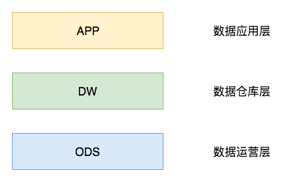
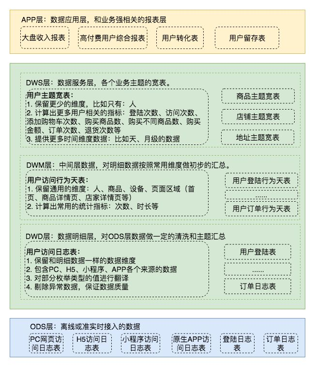
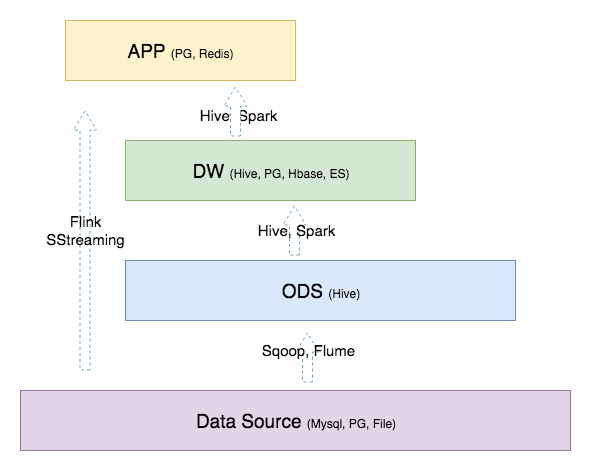

# 通用的数据仓库分层方法

## 1 概述

本文将指出一种通用的数据仓库分层方法，具体包含如下内容：

- 介绍数据分层的作用

- 提出一种通用的数据分层设计，以及分层设计的原则

- 举出具体的例子说明

- 提出可落地的实践意见

## 2 数据分层

“为什么要设计数据分层？”

这应该是数据仓库同学在设计数据分层时首先要被挑战的问题，类似的问题可能会有很多，比如说“为什么要做数据仓库？”、“为什么要做元数据管理？”、“为什么要做数据质量管理？”。当然，这里我们只聊一下为什么要做设计数据分层。

作为一名数据的规划者，我们肯定希望自己的数据能够有秩序地流转，数据的整个生命周期能够清晰明确被设计者和使用者感知到。直观来讲就是如下的左图这般层次清晰、依赖关系直观。

但是，大多数情况下，我们完成的数据体系却是依赖复杂、层级混乱的。如下的右图，在不知不觉的情况下，我们可能会做出一套表依赖结构混乱，甚至出现循环依赖的数据体系。

因此，我们需要一套行之有效的数据组织和管理方法来让我们的数据体系更有序，这就是谈到的数据分层。数据分层并不能解决所有的数据问题，但是，数据分层却可以给我们带来如下的好处：

	清晰数据结构：每一个数据分层都有它的作用域和职责，在使用表的时候能更方便地定位和理解

	减少重复开发：规范数据分层，开发一些通用的中间层数据，能够减少极大的重复计算

	统一数据口径：通过数据分层，提供统一的数据出口，统一对外输出的数据口径

	复杂问题简单化：将一个复杂的任务分解成多个步骤来完成，每一层解决特定的问题

	将统计数据和原始数据隔离，进行解耦

## 3 一种通用的数据分层设计

为了满足前面提到数据分层带来的好处，我们将数据模型分为三层：数据运营层（ODS）、数据仓库层（DW）和数据应用层（APP）。

如下图所示。简单来讲，我们可以理解为：**ODS层存放的是接入的原始数据，DW层是存放我们要重点设计的数据仓库中间层数据，APP是面向业务定制的应用数据。**下面详细介绍这三层的设计。

### 3.1 数据运营层：ODS（Operational Data Store）

“面向主题的”数据运营层，也叫 ODS 层，是最接近数据源中数据的一层，**数据源中的数据，经过 ETL 之后，装入 ODS 层**。本层的数据，**总体上大多是按照源头业务系统的分类方式而分类的**。

一般来讲，为了考虑后续可能需要追溯数据问题，因此对于这一层就**不建议做过多的数据清洗工作，原封不动地接入原始数据即可**，至于数据的去噪、去重、异常值处理等过程可以放在后面的 DWD 层来做。

【直接通过etl存入数据，不做清洗。按照源头业务系统的分类】

### 3.2 数据仓库层：DW（Data Warehouse）

数据仓库层是我们在做数据仓库时要核心设计的一层，在这里，从 ODS 层中获得的数据按照主题建立各种数据模型。

DW 层又细分为 DWD（Data Warehouse Detail）层、DWM（Data WareHouse Middle）层和 DWS（Data WareHouse Servce）层。

#### 3.2.1 数据明细层：DWD（Data Warehouse Detail）

该层**一般保持和 ODS 层一样的数据粒度**，并且**提供一定的数据质量保证（数据清洗）**。同时，为了提高数据明细层的易用性，该层会采用一些维度退化手法，**将维度退化至事实表中，减少事实表和维表的关联**。

另外，在该层**也会做一部分的数据聚合**，将相同主题的数据汇集到一张表中，提高数据的可用性，后文会举例说明。

【一般保持和 ODS 层一样的数据粒度，提供一定的数据质量保证，做一定的清洗和主题汇总，作为数据明细层。】

#### 3.2.2 数据中间层：DWM（Data WareHouse Middle）

该层会**在 DWD 层的数据基础上，对数据做轻度的聚合操作**，生成一系列的中间表，提升公共指标的复用性，减少重复加工。

直观来讲，就是对通用的核心维度进行聚合操作，算出相应的统计指标。

【在 DWD 层的数据基础上，按照维度，对数据做轻度的聚合操作，计算出一些常用指标，如，次数、时长】

#### 3.2.3 数据服务层：DWS（Data WareHouse Servce）

**又称数据集市或宽表。按照业务划分，如流量、订单、用户等，生成字段比较多的宽表，用于提供后续的业务查询，OLAP分析，数据分发等**。

一般来讲，该层的数据表会相对比较少，一张表会涵盖比较多的业务内容，由于其字段较多，因此一般也会称该层的表为宽表。

在实际计算中，如果直接从 DWD 或者 ODS 计算出宽表的统计指标，会存在计算量太大并且维度太少的问题，因此一般的做法是，在 DWM 层先计算出多个小的中间表，然后再拼接成一张 DWS 的宽表。由于宽和窄的界限不易界定，也可以去掉 DWM 这一层，只留 DWS 层，将所有的数据在放在 DWS 亦可。

【又称数据集市或宽表，按照业务，生成字段比较多的宽表，计算更多的指标】

### 3.3 数据应用层：APP（Application）

在这里，主要是**提供给数据产品和数据分析使用的数据**。

一般会存放在 ES、PostgreSql、Redis 等系统中供线上系统使用，也可能会存在 Hive 或者 Druid 中供数据分析和数据挖掘使用。比如我们经常说的报表数据，一般就放在这里。

### 3.4 维表层（Dimension）

最后补充一个维表层，维表层主要包含两部分数据：

	高基数维度数据：一般是用户资料表、商品资料表类似的资料表。数据量可能是千万级或者上亿级别。

	低基数维度数据：一般是配置表，比如枚举值对应的中文含义，或者日期维表。数据量可能是个位数或者几千几万。

至此，我们讲完了数据分层设计中每一层的含义，这里做一个总结便于理解，如下图。

## 4 举个栗子

趁热打铁，举个栗子说明一下，如下图，可以认为是一个电商网站的数据体系设计。我们暂且只关注用户访问日志这一部分数据。

在 ODS 层中，由于各端的开发团队不同或者各种其它问题，用户的访问日志被分成了好几张表上报到了我们的 ODS 层。

为了方便大家的使用，我们在 DWD 层做了一张用户访问行为天表，在这里，我们将PC网页、H5、小程序和原生 APP 访问日志汇聚到一张表里面，统一字段名，提升数据质量，这样就有了一张可供大家方便使用的明细表了。

在 DWM 层，我们会从 DWD 层中选取业务关注的核心维度来做聚合操作，比如只保留人、商品、设备和页面区域维度。类似的，我们这样做了很多个DWM的中间表

然后在 DWS 层，我们将一个人在整个网站中的行为数据放到一张表中，这就是我们的宽表了，有了这张表，就可以快速满足大部分的通用型业务需求了。

最后，在 APP 应用层，根据需求从 DWS 层的一张或者多张表取出数据拼接成一张应用表即可。

备注：例子只是为了简单地说明每一层的作用，并不是最合理的解决方案，大家辩证地看待即可。

## 5 技术实践

既然谈到了数据分层，那不同的层次中会用到什么计算引擎和存储系统呢，本节来简单分享一下。

数据层的存储一般如下：

Data Source：数据源一般是业务库和埋点，当然也会有第三方购买数据等多种数据来源方式。业务库的存储一般是Mysql 和 PostgreSql。

ODS 层：ODS 的数据量一般非常大，所以大多数公司会选择存在HDFS上，即Hive或者Hbase，Hive居多。

DW 层：一般和 ODS 的存储一致，但是为了满足更多的需求，也会有存放在 PG 和 ES 中的情况。

APP 层：应用层的数据，一般都要求比较快的响应速度，因此一般是放在 Mysql、PG、Redis中。

计算引擎的话，可以简单参考图中所列就行。目前大数据相关的技术更新迭代比较快，本节所列仅为简单参考。

## 6 思考

如同《漫谈数据仓库和范式》一文在最后思考数据仓库和范式之间的关系一样，本文也将思考和总结一下数据分层的原则是什么？为什么要这样分层？每层之间的界限又是什么？

我个人从这几个角度来理解数据分层的划分：

从对应用的支持来讲，我们希望越靠上层次，越对应用友好。比如APP层，基本是完全为应用来设计的，很易懂，DWS层的话，相对来讲就会有一点点理解成本，然后DWM和DWD层就比较难理解了，因为它的维度可能会比较多，而且一个需求可能要多张表经过很复杂的计算才能完成。

从能力范围来讲，我们希望80%需求由20%的表来支持。直接点讲，就是大部分（80%以上）的需求，都用DWS的表来支持就行，DWS支持不了的，就用DWM和DWD的表来支持，这些都支持不了的极少一部分数据需要从原始日志中捞取。结合第一点来讲的话就是：80%的需求，我们都希望以对应用很友好的方式来支持，而不是直接暴露给应用方原始日志。

从数据聚合程度来讲，我们希望，越上层数据的聚合程度越高，看上面的例子即可，ODS和DWD的数据基本是原始日志的粒度，不做任何聚合操作，DWM做了轻度的聚合操作只保留了通用的维度，DWS做了更高的聚合操作，可能只保留一到两个能表征当前描述主体的维度。从这个角度来看，我们又可以理解为我们是按照数据的聚合程度来划分数据层次的。

## 7 总结

数据分层的设计，在某种程度上也需要通过数据命名来体现，本文的核心在于讲解数据分层的思想和方法，后面会有单独的文章来分享该如何根据数据分层来设计数据表的命名规范。

----------------------------------------------------
原文链接：[数据仓库--通用的数据仓库分层方法](https://www.cnblogs.com/itboys/p/10592871.html)